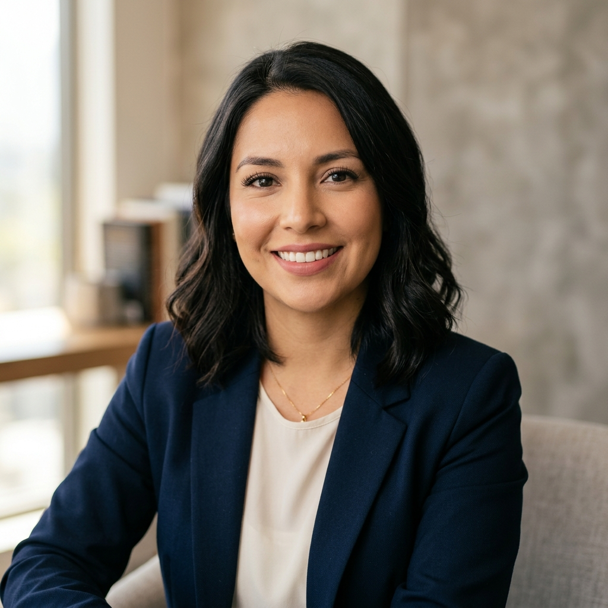

# Proto-persona — Studio Ash

> Guía: [Proto-persona](../evaluacion/guias/fase-1-requerimientos/02-proto-persona.md)

## Proto-persona principal

**Maura Salinas, 32 años.** Contadora / Trabajo Híbrido.

> "Busco un diseño de mirada natural y delicado que respete mi piel sensible y me ahorre tiempo por las mañanas."

### Comportamientos

- Busca constantemente referencias visuales y tendencias de belleza en Instagram y TikTok durante sus tiempos libres (principalmente en traslados o pausas laborales).
- Prefiere gestionar sus citas, compras y consultas directamente desde el celular o computador de manera rápida y sin llamadas telefónicas.
- Suele informarse sobre las tendencias, productos y las técnicas antes de probar un nuevo diseño o servicio.

### Necesidades

- Encontrar un estudio de belleza confiable con altos estándares de higiene para el cuidado de sus ojos, pestañas y rostro.
- Un servicio de extensión de pestañas y depilación totalmente adaptado a la forma de su rostro (morfología facial).
- Alternativas de depilación facial sin químicos ni cera para evitar rojeces e irritación en su piel sensible.
- Un medio fácil y rápido para agendar o resolver dudas sobre disponibilidad de horarios.

### Motivaciones

- Mantener un aspecto arreglado y natural sin necesidad de maquillarse todos los días y ahorrar tiempo.
- Sentir un trato exclusivo, cómodo y personalizado en un ambiente profesional y seguro.
- Invertir en tratamientos duraderos que garanticen la salud de sus pestañas y piel.

### Frustraciones

- Experiencias pasadas con irritaciones o alergias debido al uso de cera tradicional o productos químicos agresivos.
- Sitios web confusos que no muestran información clara de los servicios ni vías directas para agendar.
- Diseños genéricos de pestañas que no se ajustan a la forma real de sus ojos ni a su estilo de vida.
